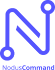

# NodusCommand

Modern WordPress local development environment powered by Docker/Podman.

## Features

✨ **Modern CLI** - Beautiful, interactive command-line interface
🐳 **Docker & Podman** - Support for both container engines
🚀 **Quick Setup** - Get WordPress running in seconds
📦 **Clean WordPress** - Download fresh WordPress with minimal bloat
🔄 **Remote Sync** - Pull database and files from production via SSH (key or password)
💾 **Database Backups** - Automatic backup system for local databases
🎯 **Flexible Pulls** - Sync everything, just DB, just files, or just uploads
🔒 **Automatic HTTPS** - Local HTTPS certificates with mkcert integration
📍 **Domain Management** - Automatic `/etc/hosts` management for local domains
👤 **cPanel-style user** - Apache container runs as `webuser` (non-root), full sudo available
🗄️ **Import DB** - Import any `.sql` backup directly into the local container
ℹ️ **Project Info** - View all project details, URLs, and credentials at a glance

## Requirements

- Node.js 18+ 
- Docker or Podman
- rsync (for remote file sync)
- SSH access to remote server (optional, for pull commands)

## Recommendation
Install PODMAN desktop [Learn more here](https://podman-desktop.io)

## Installation

```bash
# Install via PNPM
pnpm install -g nodus-command
```

### Or

```bash
# Clone the repository
git clone https://github.com/nodus-stack/nodus-command.git
cd nodus-command

# Install dependencies
npm install

# Link globally
npm link

# Verify installation
noduscm --version
```

## Quick Start

```bash
# Initialize a new WordPress project
noduscm init

# Start the project
noduscm up

# Access your site
# https://my-wordpress-site.localhost:8443 (or your configured domain)
```

## Examples Guide

For practical workflows and real-world command usage, see:

- [`examples/README.md` (ES)](examples/README.md)
- [`examples/README.en.md` (EN)](examples/README.en.md)
- [`examples/CHEATSHEET.md` (ES/EN Quick Sheet)](examples/CHEATSHEET.md)

## Commands

### `noduscm init`
Initialize a new WordPress project with interactive prompts.

**Options:**
- Blank project or existing project
- WordPress version selection
- Local or remote database
- SSH configuration for remote sync
- `--mount <entry>` Add custom bind mount entry (repeatable)

**Examples:**
```bash
# Fully interactive init
noduscm init

# Init with predefined local repo mounts (no mount prompt)
noduscm init \
  --mount /home/User/WorkspacePHP/Nodus-Extension-Template:/var/www/html/wp-content/plugins/nodus-extension-template:z \
  --mount /home/User/WorkspacePHP/Nodus-Apex:/var/www/html/wp-content/themes/nodus-apex:z
```

### `noduscm up`
Start the WordPress development environment.

If `wordpress/` or `wp-content/` is missing and SSH is configured, `up` automatically bootstraps files from remote before starting containers.

### `noduscm generate`
Regenerate Docker files from current `.noduscm.json` configuration.

Generated files:
- `docker-compose.yml`
- `Dockerfile.apache`

**Example:**
```bash
noduscm generate
```

### `noduscm rebootstrap`
Restore missing project files (`wordpress/` and `wp-content/`) using current `.noduscm.json`.

- If SSH is configured, it pulls files from remote (`pull --files-only` flow).
- If SSH is not configured, it downloads WordPress core locally and ensures base `wp-content/` structure.
- Use `--force` to rebuild both folders even if they already exist.

### `noduscm down`
Stop the WordPress development environment.

### `noduscm remove`
Remove the project completely (containers, volumes, config files).

**Note:** WordPress core and wp-content are preserved.

### `noduscm pull [options]`
Sync files and/or database from remote server.

**Options:**
- `--db-only` - Only sync database
- `--files-only` - Only sync files (no database)
- `--uploads-only` - Only sync wp-content/uploads folder
- `--specified-path <path>` - Only sync specific remote path(s) into the same local project path (repeatable)
- `--exclude <path>` - Exclude a path/pattern from file sync (repeatable)
- `--files-container-only` - Only sync project files from a remote container (Coolify mode)
- `--db-container-only` - Only sync database by dumping from a remote container (Coolify mode)
- `--uploads-container-only` - Only sync wp-content/uploads from a remote container (Coolify mode)
- `--container-id <id>` - Remote container ID/name (required with container pull modes)

**Examples:**
```bash
# Sync everything (files + database)
noduscm pull

# Full file sync layout used by NodusCommand:
# remote root -> local wordpress/
# remote wp-content -> local wp-content/

# Only pull database
noduscm pull --db-only

# Only pull uploads folder
noduscm pull --uploads-only

# Only pull a specific path (remotePath + /wp-content/themes/nodus-apex)
noduscm pull --specified-path=/wp-content/themes/nodus-apex

# Pull multiple specific paths with one argument (brace expansion)
noduscm pull --specified-path='/wp-content/{uploads,mu-plugins}'

# Pull multiple specific paths with repeated option
noduscm pull \
  --specified-path /wp-content/uploads \
  --specified-path /wp-content/mu-plugins

# Pull wp-content excluding selected paths
noduscm pull --specified-path /wp-content \
  --exclude /wp-content/themes/nodus-apex \
  --exclude /wp-content/plugins/juzt-extensention-raffles

# Pull all files but exclude selected directories
noduscm pull --files-only \
  --exclude wp-content/uploads/cache \
  --exclude wp-content/upgrade

# Pull DB from remote DB container (Coolify)
noduscm pull --db-container-only --container-id your-db-container

# Pull uploads from remote app container (Coolify)
noduscm pull --uploads-container-only --container-id your-app-container

# Pull project files from remote app container (Coolify)
noduscm pull --files-container-only --container-id your-app-container
```

### `noduscm backup`
Create a backup of the local database.

**Related commands:**
```bash
# List all backups
noduscm backup:list

# Restore a backup
noduscm backup:restore
```

### `noduscm import-db <file>`
Import a local `.sql` file directly into the local MySQL container.

Automatically strips `USE`, `CREATE DATABASE`, and `DROP DATABASE` statements — no need to edit the dump when the remote database name differs from the local one.

**Example:**
```bash
noduscm import-db /path/to/backup.sql
```

### `noduscm info`
Display full project summary: local URL (HTTPS-aware), local database, remote database, SSH connection, and port configuration.

```bash
noduscm info
```

### `noduscm shell`
Open an interactive bash session inside the Apache container.

By default connects as `webuser` (non-root, cPanel-style). Use `--root` to connect as root.

```bash
# Connect as webuser (default)
noduscm shell

# Connect as root
noduscm shell --root
```

Inside the container as `webuser`:
```bash
wp plugin list         # WP-CLI without sudo
wp cache flush
sudo service apache2 restart  # admin commands via sudo (password: webuser)
```

## Configuration

NodusCommand stores project configuration in `.noduscm.json`:

```json
{
  "domain": "my-wordpress-site.localhost",
# Access your site
# https://my-wordpress-site.localhost:8443 (or your configured domain with HTTPS)
# Certificates are automatically generated and trusted by your system
  "wpVersion": "6.9",
  "engine": "podman",
  "database": {
    "type": "local",
    "host": "my-wordpress-site-mysql",
    "name": "wordpress",
    "user": "wordpress",
    "password": "wordpress",
    "rootPassword": "root"
  },
  "tablePrefix": "wp_",
  "ssh": {
    "host": "example.com",
    "port": 22,
    "user": "username",
    "authType": "key",
    "keyFile": "/path/to/ssh/key",
    "remotePath": "/var/www/html",
    "database": {
      "host": "localhost",
      "name": "production_db",
      "user": "db_user",
      "password": "db_password"
    }
  },
  "mounts": [
    "/home/[USER]/nodus-extension-template:/var/www/html/wp-content/plugins/nodus-extension-template:z"
  ],
  "env": {
    "MY_PASSWORD_FOR_SOMETHING": "VALUE"
  }
}
```
### HTTPS & Port Configuration

By default, NodusCommand enables automatic HTTPS with locally-trusted certificates:

```json
{
  "localHttps": true,
  "localHttpsPort": 8443,
  "localApachePort": 8080,
  "localMysqlPort": 3306,
  "autoManageHosts": true
}
```

**Configuration fields:**
- `tablePrefix`: WordPress database table prefix (default: `wp_`). Also accepted as `database.tablePrefix`.
- `localHttps`: Enable automatic HTTPS with mkcert (default: `true`)
- `localHttpsPort`: HTTPS listen port (default: `8443`)
- `localApachePort`: HTTP listen port (default: `8080`)
- `localMysqlPort`: MySQL listen port (default: `3306`)
- `autoManageHosts`: Auto-add domain to `/etc/hosts` (default: `true`)
- `ssh.authType`: SSH authentication type — `"key"` (default) or `"password"`

### Apache Container Environment Variables

You can inject custom environment variables into the Apache container by adding an `env` object in `.noduscm.json`:

```json
{
  "env": {
    "MY_PASSWORD_FOR_SOMETHING": "VALUE",
    "FEATURE_FLAG": "true"
  }
}
```

After editing config, regenerate/start the project:

```bash
noduscm generate
noduscm up
```

## Custom Bind Mounts

During `noduscm init`, you can add custom bind mounts for local repositories (for example plugins/themes) so you can work directly without cloning/syncing into `wp-content` manually.

For existing projects, add `mounts` directly in `.noduscm.json` and run `noduscm up` (the compose file is regenerated from config on startup).

Example mount entry format:

```bash
/absolute/local/path:/var/www/html/wp-content/plugins/plugin-slug:z
```

## Default Pull Excludes (non-interactive)

You can persist default excludes in `.noduscm.json` so you don't need to pass `--exclude` every time:

```json
{
  "pullDefaults": {
    "exclude": [
      "/wp-content/themes/nodus-apex",
      "/wp-content/plugins/juzt-extensention-raffles"
    ]
  }
}
```

`noduscm pull`, `noduscm pull --files-only`, and `noduscm pull --specified-path ...` automatically merge these defaults with any `--exclude` passed in CLI.

## Project Structure

```
your-project/
├── .noduscm/
│   ├── backups/           # Database backups
│   └── ...
├── wordpress/             # WordPress core files
├── wp-content/            # Your themes, plugins, uploads
├── docker-compose.yml     # Container configuration
├── apache.conf            # Apache virtual host config
├── Dockerfile.apache      # Custom PHP image with extensions
├── custom-php.ini         # PHP configuration overrides
└── .noduscm.json        # Project configuration
```

## Database Access

Connect to your local MySQL database using any database client:

**Connection Details:**
- Host: `localhost`
- Port: `3306`
- Database: As configured in `.noduscm.json`
- Username: As configured in `.noduscm.json`
- Password: As configured in `.noduscm.json`

## Migration: 80/443 to 8080/8443

If you are migrating from old privileged ports (`80`/`443`) to the current defaults (`8080`/`8443`), update `.noduscm.json`:

```json
{
  "localHttps": true,
  "localApachePort": 8080,
  "localHttpsPort": 8443,
  "localMysqlPort": 3306,
  "autoManageHosts": true
}
```

Then regenerate and restart:

```bash
noduscm down
noduscm generate
noduscm up
```

Use your domain URL with HTTPS, for example:

```text
https://my-project.localhost:8443
```

## Customization

### PHP Configuration

Edit `custom-php.ini` to override PHP settings:

```ini
upload_max_filesize = 128M
post_max_size = 128M
memory_limit = 256M
max_execution_time = 300
```

### Apache Configuration

Edit `apache.conf` to customize virtual host settings.

### Database Port

If port 3306 is already in use, modify `docker-compose.yml`:

```yaml
mysql:
  ports:
    - "3307:3306"  # Use port 3307 instead
```

## Troubleshooting

### Permission Errors on Linux/Mac

If you encounter permission issues with uploads:

```bash
# Fix wp-content permissions
sudo chown -R $USER:$USER wp-content/
```

### Port Already in Use

Change the Apache port in `docker-compose.yml`:

```yaml
apache:
  ports:
    - "8081:80"  # Change 8080 to 8081
```

### Container Won't Start

Check logs:

```bash
podman logs [container-name]
# or
docker logs [container-name]
```

## Contributing

Contributions are welcome! Please feel free to submit a Pull Request.

## License

MIT

## Author

Jesus Uzcategui [@User](https://github.com/jesusuzcategui)

[](https://ko-fi.com/Q5Q31P7KUS)

## Part of Nodus Stack Ecosystem

- **Nodus Apex** - WordPress Theme [Repository](https://github.com/nodus-stack/nodus-apex)
- **Nodus Designer** - Template Builder/Customizer [Repository](https://github.com/nodus-stack/nodus-designer)
- **Nodus Jet** - GitHub Deployment & Previews - [Repository](https://github.com/nodus-stack/nodus-jet)
- **Nodus Extension Template** - Starter Plugin Template [Repository](https://github.com/nodus-stack/Nodus-Extension-Template)

---

**Made with ❤️ for modern WordPress development**